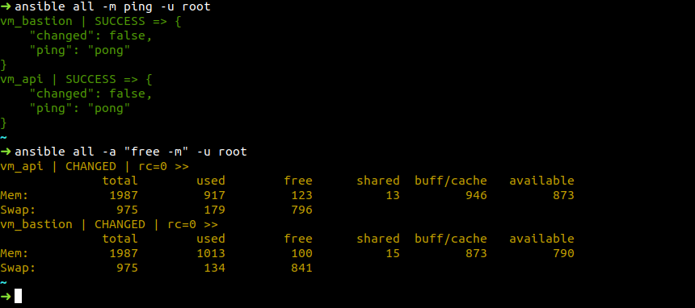

# Ansible

## 1. Ansible là gì ?
- Tool quản lý, tự động hóa việc cấu hình trên  server (ex: chuẩn bị môi trường, quản lý cấu hình, deploy ứng dụng, ...)
- Ansible quản lý các node server/tài nguyên bằng các file playbook => có thể config từng node tập trung trong file quản lý. Các node này được kết nối qua SSH và thực thi các ansible modules viết bằng python script. Sau khi thực hiện xong ansible modules sẽ được remove khỏi các node.

## 2. Tại sao nên sử dụng Ansible ?
- Quản lý nhiều server tập trung => Giảm thiểu thời gian thao tác config từng server
- Có thể kiểm soát các version hệ thống để quản lý thay đổi ở tầng infra
- Không cần database hay phần mềm cài thêm ở clients dể chạy. Chỉ cần cài ssh trên các server và trên máy host có ansible để quản lý các server tập trung.
- Không sinh thêm service hay daemon chạy ngầm ở server khi được gọi
- Sử dụng các file yaml để quản lý, cấu hình infra => dễ sử dụng

## 3. Các thuật ngữ trong Ansible
- Controller: máy cài Ansible. Chịu trách nhiệm quản lý, điều khiển cấu hình các server cần quản lý.
- Inventory: file chứa thông tin các server cần quản lý. Nằm tại /etc/ansible/hosts.
- Playbook: file yaml chứa các task của Ansible. Controller sẽ đọc các task trong Playbook và đẩy các lệnh thực thi bằng Python tới các server. VD
  ```
    - name: Playbook
      hosts: webservers
      become: yes
      become_user: root
      tasks:
        - name: ensure apache is at the latest version
          yum:
            name: httpd
            state: latest
        - name: ensure apache is running
          service:
            name: httpd
            state: started
  ```

- Task: Một block ghi tác vụ cần thực hiện trong playbook và các thông số liên quan. VD:
  ```
  tasks:
  - name: ensure apache is at the latest version
    yum:
      name: httpd
      state: latest
  - name: ensure apache is running
    service:
      name: httpd
      state: started
  ```

- Module: các đoạn code Ansible thực thi. Mỗi module có một chức năng khác nhau như quản lý user cho database, quản lý vlan interface,... Một module có thể execute bằng task hoặc các module khác trong file playbook.
- Role: một tập playbook được định nghĩ a sẵn để thực thi 1 tác vụ nhất định.
- Play: quá trình thực thi của 1 playbook
- Facts: thông tin của những máy được Ansible điều khiển, cụ thể là thông tin về OS, network, system…
- Handlers: Dùng để kích hoạt các thay đổi của dịch vụ như start, stop service.

## 4. Cài đặt Ansible
- Install
  ```
  sudo apt-add-repository ppa:ansible/ansible
  sudo apt update
  sudo apt install ansible
  ```
- List các host cần quản lý trong file inventory
  ```
  [servers]
  server_alias ansible_host=xxx.xxx.x.xx ansible_ssh_user=username
  [all:vars]
  ansible_python_interpreter=/usr/bin/python3
  ```
- Ping thử tới các server
  
