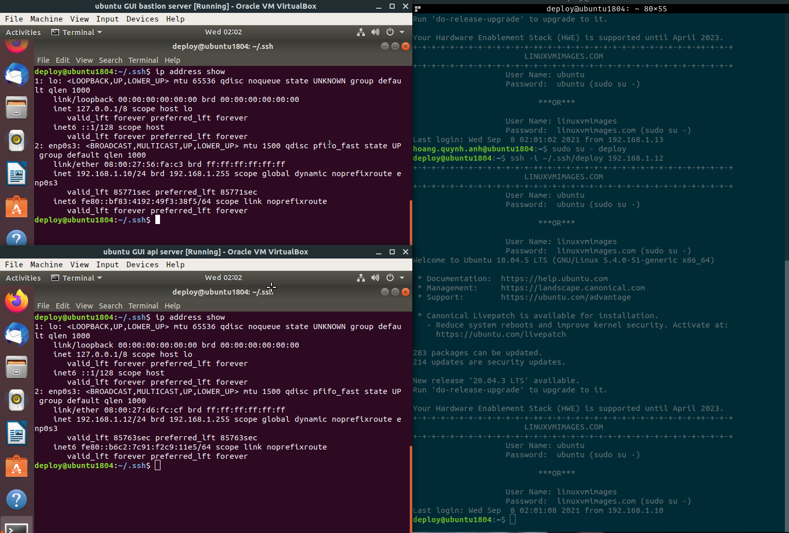
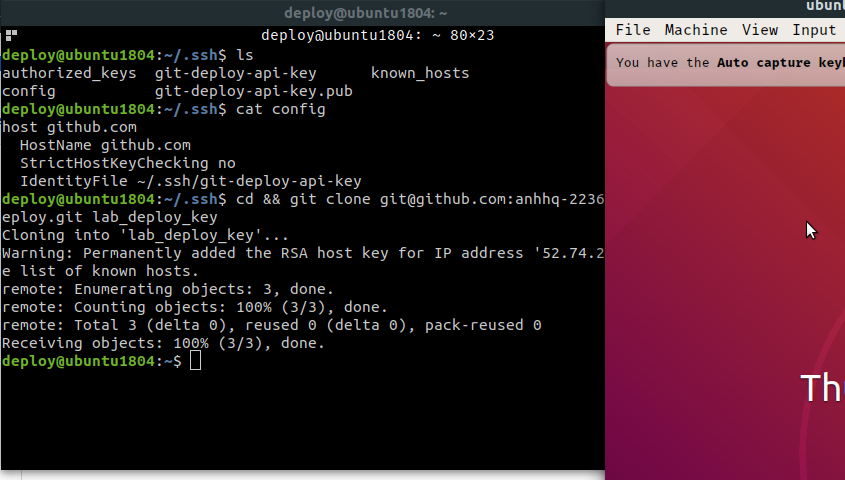
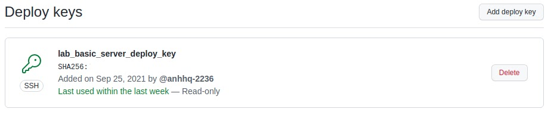
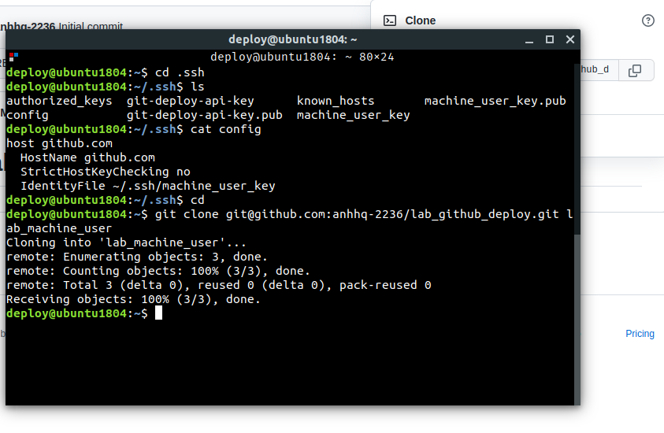
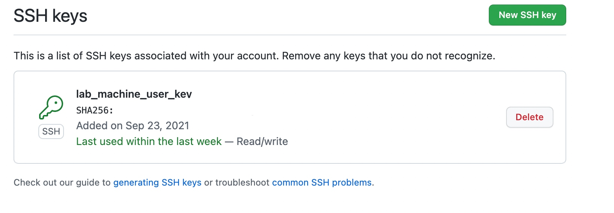
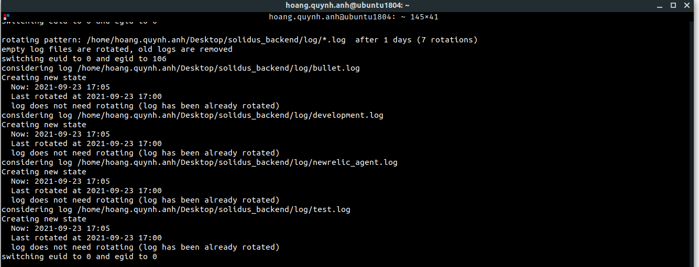

# Linux basic

## 1. Check OS version

```
$ cat /etc/os-release
$ lsb_release -a
$ cat /proc/version
$ hostnamectl
```

## 2. User & Group
- list all groups: `$ cat /etc/group`
- list all users: `$ cat /etc/passwd`
=> 2 types of groups: primary group and secondary group. Default group of an user is primary group.

- Create user: `sudo useradd <options> <username> -p <password>`
  - Ex: `sudo useradd -m -s /bin/bash nguyen.van.a`
- Create group: `sudo groupadd <group_name>`
  - Ex: `sudo groupadd deploy`
- Add user to group: `sudo usermod -a -G <group_name>`

## 3. Time synchronization
- Sử dụng systemd’s timesyncd hoặc chrony
- Time synchronization: 1 host có 2 hệ thống time: system time và rct time => chronyd và systemd-timesyncd để synchronize thời gian ở local host với một time server
* chronyd:
  + `sudo apt-get install chrony`
  + check status: `sudo systemctl status chronyd`
  + kiểm tra thông tin sync của chrony: `chronyc tracking`
  + file config: `vim /etc/chrony/chrony.conf`

* systemd-timesyncd
  + mặc định trong ubuntu, nếu không có chạy `sudo apt-get install systemd-timesyncd`
  + check status: `systemctl status systemd-timesyncd`
  + kiểm tra thông tin sync: `timedatectl timesync-status`
  + file config: `vim /etc/systemd/timesyncd.conf`
  + start service: `sudo systemctl enable systemd-timesyncd.service`

## 4. PAM
- PAM: Pluggable Authentication Module - cơ chế cho phép tích hợp các phương thức authentication của hệ thống vào các service. (Các service cần xác thực thay vì sử dụng user và password thì có thể thông qua PAM. VD: sudo, login, sshd, pam)
- check host có hỗ trợ PAM: `ldd /bin/su`
- folder config: `cd /etc/pam.d/` => hiển thị các service sử dụng PAM(vd: cron, login, newuser, passwd, sudo,...)
- Để config PAM cho 1 service: `vim <tên service trong folder pam.d> (VD: vim cron)`
- PAM có 4 module chính: auth, account, password, session
- pam_limits: 1 module nhỏ của session để giới hạn tài nguyên sử dụng trong 1 user session, kể cuser root uid=0
- Ex: cd /etc/pam.d/ && vim login
`session  required  pam_limits.so`

## Lab

### Create server bastion and api, then ssh to these server using user deploy


### Clone git repo to server using deploy key



### Clone git repo to server using machine user



### Logrotate
- Setup log rotate for rails project and test

